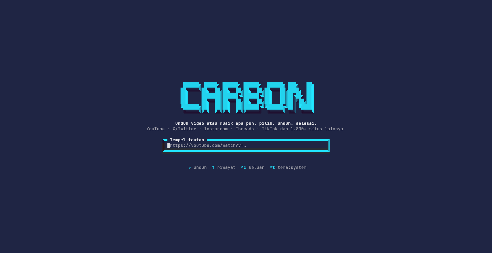
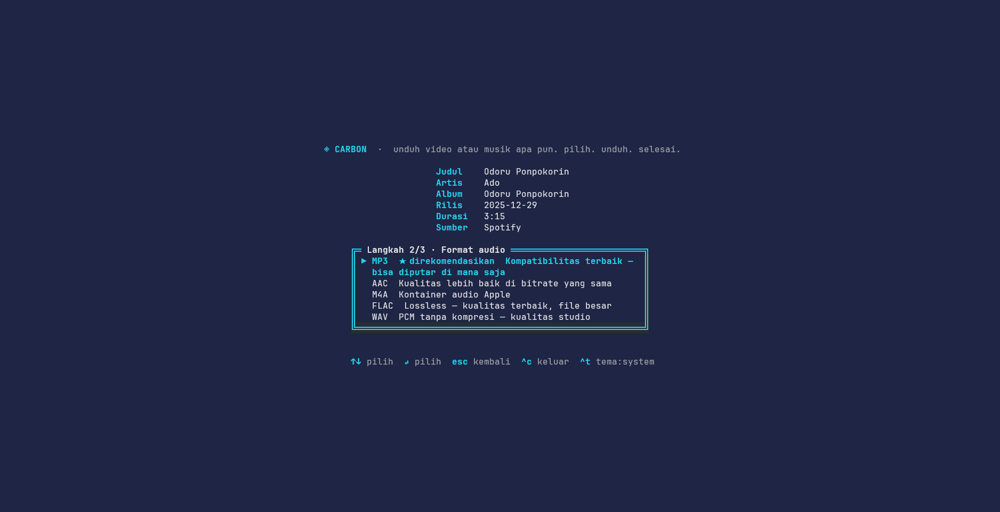

<div align="center">

<pre>
 ██████╗ █████╗ ██████╗ ██████╗  ██████╗ ███╗   ██╗
██╔════╝██╔══██╗██╔══██╗██╔══██╗██╔═══██╗████╗  ██║
██║     ███████║██████╔╝██████╔╝██║   ██║██╔██╗ ██║
██║     ██╔══██║██╔══██╗██╔══██╗██║   ██║██║╚██╗██║
╚██████╗██║  ██║██║  ██║██████╔╝╚██████╔╝██║ ╚████║
 ╚═════╝╚═╝  ╚═╝╚═╝  ╚═╝╚═╝      ╚═════╝ ╚═╝  ╚═══╝
</pre>

**grab any video or music. pick. download. done.**

YouTube · X/Twitter · Instagram · Threads · TikTok and 1,800+ other sites

[](https://github.com/AlFarrizi-Studio/Carbon-DL/releases)
[](https://nodejs.org)
[](LICENSE)
[](https://github.com/AlFarrizi-Studio/Carbon-DL/releases)

</div>

---

**Carbon** is a terminal-based video & audio downloader with a beautiful interactive UI. Paste any link from YouTube, TikTok, Instagram, X, SoundCloud, or 1800+ other sites, and Carbon walks you through picking exactly what you want — format, resolution, FPS, bitrate.

## ✨ Features

- 🎬 **Video downloads** — MP4, MKV, WEBM, MOV, AVI
- 🎵 **Audio / music downloads** — MP3, AAC, M4A, FLAC, WAV
- 🎚️ **Audio bitrate picker** — 8 kbps up to 512 kbps (FLAC/WAV are lossless)
- 🖥️ **Resolution picker** — from 360p up to 4K
- 🎞️ **FPS picker** — source FPS, 24, 30, or 60
- 🖼️ **Cover art** — shows the video/music thumbnail in the wizard using native terminal graphics (Kitty, iTerm2, Sixel) with a half-block fallback
- 🎨 **Themes** — `system`, `dark`, or `light` (press `^t` to cycle live)
- 🌐 **1800+ sites** — powered by yt-dlp
- 🌍 **Multi-language** — auto-detects your system language (20+ languages)
- 🔔 **Update notifications** — in-app badge when a new GitHub release is available
- 📋 **History** — recall recent links with ↑/↓
- ⚡ **Zero setup** — auto-downloads yt-dlp on first run, bundles ffmpeg fallback

<div align="center">

| Input screen | Download wizard |
|:---:|:---:|
|  |  |

</div>

## 🚀 Install

Pick your platform and run the one-liner. Then just run `carbon-dl`.

**Windows (PowerShell):**

```powershell
irm https://raw.githubusercontent.com/AlFarrizi-Studio/Carbon-DL/main/install.ps1 | iex
```

**Linux:**

```bash
curl -fsSL https://raw.githubusercontent.com/AlFarrizi-Studio/Carbon-DL/main/install.sh -o install.sh && bash install.sh
```

**macOS (Homebrew):**

```bash
brew tap AlFarrizi-Studio/Carbon-DL https://github.com/AlFarrizi-Studio/Carbon-DL
brew install AlFarrizi-Studio/Carbon-DL/carbon-dl
```

Then run it:

```bash
carbon-dl
```

> **Node.js 18+** is required — if it's not installed, the installers download and set it up automatically. No npm needed!

## 📖 Usage

```bash
carbon-dl                          # interactive — paste a link
carbon-dl https://youtu.be/xyz     # start with a link
carbon-dl --theme dark             # force dark theme
carbon-dl update                   # update to the latest version
carbon-dl update --force           # re-download even if already latest
carbon-dl uninstall                # remove Carbon completely
carbon-dl --help                   # show help
carbon-dl --version                # show version
```

### The wizard

1. **Paste a link** — Carbon detects the platform and fetches media info
2. **Step 1** — choose **Video** or **Audio/Music**
3. **Step 2** — choose your **format** (MP4/MKV/WEBM/MOV/AVI or MP3/AAC/M4A/FLAC/WAV)
4. **Step 3** — choose **resolution** + **FPS** (video) or **bitrate** (audio)
5. Watch the progress bar — file lands in `~/Downloads`

### Keyboard shortcuts

| Key | Action |
|-----|--------|
| `↵` | submit / select |
| `↑↓` | navigate choices / history |
| `esc` | go back / cancel |
| `^t` | cycle theme (system → dark → light) |
| `^c` | quit |

## 🎨 Themes

```bash
carbon-dl --theme system   # follow terminal colors (default)
carbon-dl --theme dark     # dark-optimized palette
carbon-dl --theme light    # light-optimized palette
```

Press `^t` inside the app to cycle themes live.

## 🌍 Languages

Carbon auto-detects your system language. Override it with:

```bash
CARBON_LANG=id carbon-dl    # force Indonesian
CARBON_LANG=ja carbon-dl    # force Japanese
```

Supported: English, Indonesian, Spanish, French, German, Portuguese, Italian, Russian, Japanese, Korean, Chinese (Simplified & Traditional), Arabic, Hindi, Turkish, Vietnamese, Thai, Malay, Dutch, Polish, Ukrainian, Filipino, and more.

## 🔔 Updates

When a newer release is published on GitHub, Carbon shows a badge in the top-right corner:

```
↑ Update Carbon available: vX.Y.Z
```

To update, run:

```bash
carbon-dl update
```

This checks GitHub for the latest release and replaces the installed `cli.js` automatically — works on Windows, Linux, and macOS. Use `--force` to re-download even when already on the latest version (useful for repairing a corrupted install).

Alternatively, re-run the install command for your platform above — it always fetches the latest release.

## 🗂️ Where files go

Downloads are saved to your `~/Downloads` folder.

## 🧰 How it works

- [yt-dlp](https://github.com/yt-dlp/yt-dlp) does the heavy lifting (extraction + download). Carbon auto-downloads the binary on first run if it's not on your PATH.
- [ffmpeg](https://ffmpeg.org) merges video+audio streams and converts formats. Carbon uses your system ffmpeg, or auto-downloads a static build on first run if none is found.
- UI is built with [Ink](https://github.com/vadimdemedes/ink) (React for CLIs).
- Cover art is rendered via the best available terminal graphics protocol — Kitty (placeholders), iTerm2 (inline images), or Sixel (CPR-anchored) — with a universal half-block (▀) fallback. Image decoding uses [sharp](https://github.com/lovell/sharp) when available, falling back to [jimp](https://github.com/jimp-dev/jimp) (pure JS, bundled) so thumbnails always work even in the single-file installed build.

## 🛠️ Development

```bash
git clone https://github.com/AlFarrizi-Studio/Carbon-DL.git
cd Carbon-DL
npm install
npm run build
npm link          # makes `carbon-dl` available globally
```

| Script | Description |
|--------|-------------|
| `npm run build` | Build with tsup |
| `npm run dev` | Watch mode |
| `npm run typecheck` | TypeScript check |
| `npm start` | Run built CLI |

## 📄 License

[Apache-2.0](LICENSE)
